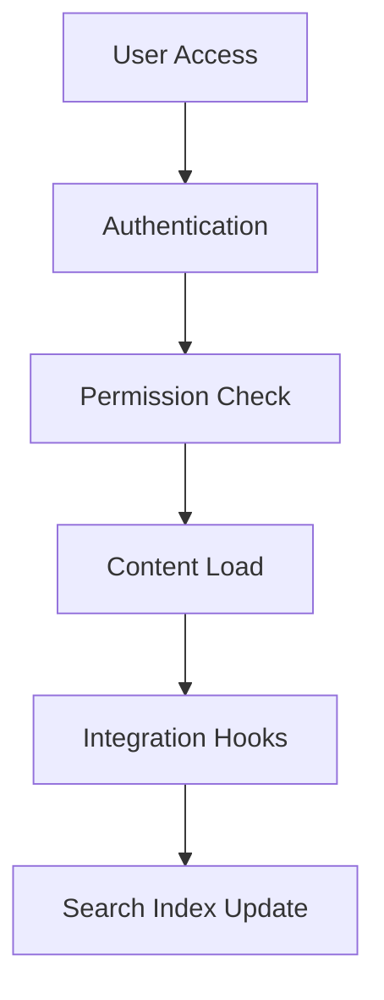

## Workspace Settings

You configure GTECH Documentation to match your team's preferences and requirements. This includes setting permissions, themes, and integrations that enhance usability. Adjust these options to optimize your documentation environment from the start.

<Steps>
  <Step title="Access Settings" icon="settings">
    Navigate to the workspace dashboard and select the settings gear icon.
  </Step>
  <Step title="Define Permissions" icon="lock">
    Assign roles to users: admin for full control, editor for content management, viewer for read access.
    ```javascript
    // API example for updating user roles
    await fetch(`/api/workspaces/${workspaceId}/users/${userId}`, {
      method: 'PATCH',
      headers: { 'Authorization': `Bearer ${token}` },
      body: JSON.stringify({ role: 'editor' })
    });
    ```
  </Step>
  <Step title="Enable Integrations" icon="plug">
    Connect external services like GitHub for automatic syncing.
    <Callout kind="tip">
      Integrations require OAuth approval for secure access.
    </Callout>
  </Step>
</Steps>

<Tabs>
  <Tab title="Theme Customization" icon="sun">
    Choose from light, dark, or custom themes to improve readability.
    ```css
    /* Custom CSS example for branding */
    .docs-header {
      background-color: #3B82F6;
      color: white;
    }
    .content-body {
      font-family: 'Inter', sans-serif;
    }
    ```
    <Expandable title="Advanced Styling">
      Override default styles using CSS variables like `--primary-color` for brand alignment.
    </Expandable>
  </Tab>
  <Tab title="Notification Setup" icon="bell">
    Configure email and Slack notifications for document updates and mentions.
    You set thresholds for alerts, such as notifying on edits by non-admins.
  </Tab>
</Tabs>

<Columns cols={2}>
  <Card title="Backup Configuration" icon="database" href="#">
    Schedule automatic backups to external storage like S3 for data safety.
  </Card>
  <Card title="Search Indexing" icon="search" href="#">
    Enable full-text search with custom stop words and synonyms.
  </Card>
</Columns>

<CodeGroup tabs="YAML,JSON">
  ```yaml
  # Configuration file example for workspace
  workspace:
    name: 'Project Docs'
    theme: 'dark'
    integrations:
      github:
        repo: 'org/project-docs'
        webhook: true
      slack:
        channel: '#docs-updates'
  permissions:
    defaultRole: 'viewer'
  ```
  ```json
  {
    "workspace": {
      "name": "Project Docs",
      "theme": "dark",
      "integrations": {
        "github": {
          "repo": "org/project-docs",
          "webhook": true
        },
        "slack": {
          "channel": "#docs-updates"
        }
      },
      "permissions": {
        "defaultRole": "viewer"
      }
    }
  }
  ```
</CodeGroup>

<Callout kind="danger">
  Review all integration permissions carefully to avoid exposing sensitive data.
</Callout>

<ExpandableGroup>
  <Expandable title="Environment Variables">
    Set `GTECH_API_KEY` and `GTECH_WEBHOOK_SECRET` in your deployment environment. These secure API calls and webhook verifications, preventing unauthorized access.
  </Expandable>
  <Expandable title="Custom Domains">
    Map a custom domain like docs.yourcompany.com to your workspace. Configure DNS records (CNAME) pointing to GTECH's servers for branded access.
  </Expandable>
</ExpandableGroup>



With these configurations, you tailor GTECH Documentation to fit seamlessly into your workflow. Regularly review settings as your project evolves to maintain efficiency.