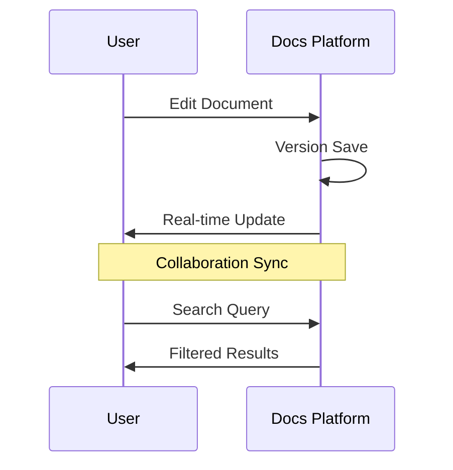

## Core Capabilities

You leverage GTECH Documentation's features to create a dynamic knowledge base for your projects. From real-time collaboration to advanced search, these tools ensure your documentation stays current and accessible. Discover how each feature contributes to a streamlined documentation process.

<Columns cols={3}>
  <Card title="Version Control" icon="git-branch" href="#">
    Track changes with Git-like versioning for every document revision.
  </Card>
  <Card title="Rich Editing" icon="edit" href="#">
    Edit with Markdown, MDX support, and embed images or code snippets effortlessly.
  </Card>
  <Card title="Analytics Dashboard" icon="bar-chart" href="#">
    Monitor document usage with views, edits, and engagement metrics.
  </Card>
</Columns>

<Steps>
  <Step title="Collaborate in Real Time" icon="message-square">
    Multiple users edit simultaneously with live cursors and conflict resolution. You see changes as they happen, reducing merge conflicts.
    ```javascript
    // WebSocket example for real-time updates
    const socket = new WebSocket('wss://api.gtechdocs.com/ws');
    socket.onmessage = (event) => {
      const update = JSON.parse(event.data);
      if (update.type === 'edit') {
        applyDelta(update.content);
      }
    };
    ```
  </Step>
  <Step title="Embed Interactive Content" icon="code">
    Include diagrams, videos, and interactive demos directly in docs.
  </Step>
  <Step title="Export Options" icon="download">
    Generate PDFs, HTML sites, or API specs from your documentation.
    <Callout kind="info">
      Exports preserve formatting and links for professional sharing.
    </Callout>
  </Step>
</Steps>

<Tabs>
  <Tab title="Search Features" icon="search">
    Perform advanced searches with filters for tags, dates, and authors. Semantic search understands context, surfacing relevant docs even with varied phrasing.
    <CodeGroup tabs="Query Examples">
      ```javascript
      // API search query
      const results = await fetch('/api/search', {
        method: 'POST',
        body: JSON.stringify({
          query: 'authentication setup',
          filters: { tags: ['security'] }
        })
      });
      ```
    </CodeGroup>
  </Tab>
  <Tab title="Template System" icon="file-text">
    Use reusable templates for consistent documentation across projects. You customize templates with variables for dynamic content insertion.
    <Expandable title="Template Variables">
      Variables like `{project-name}` and `{version}` auto-populate during creation. This ensures uniformity without manual repetition.
    </Expandable>
  </Tab>
</Tabs>

<Callout kind="success">
  All features support both light and dark modes for user comfort.
</Callout>

<ExpandableGroup>
  <Expandable title="Security Features">
    Encrypt documents at rest and in transit. You enable two-factor authentication and audit logs for compliance.
  </Expandable>
  <Expandable title="Scalability">
    Handle thousands of documents with automatic scaling. Enterprise plans offer dedicated instances for high-traffic teams.
  </Expandable>
</ExpandableGroup>



GTECH Documentation's features empower you to maintain high-quality, accessible project docs. Integrate these capabilities to boost team productivity and knowledge sharing.